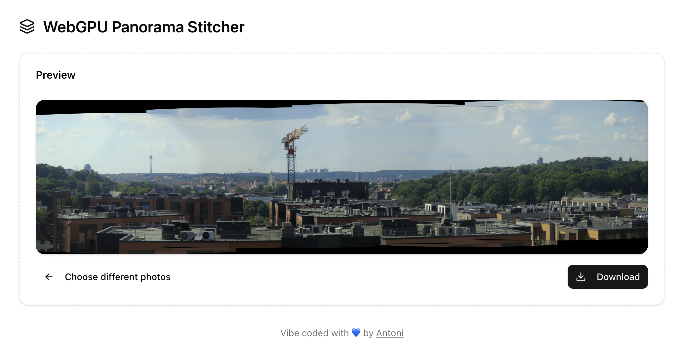

# WebGPU Panorama Stitcher (React/Next.js)

Panorama stitching **in the browser** — GPU‑accelerated with **WebGPU** and feature matching/seam finding via **OpenCV.js (4.3.0)**.



---

## ✨ Features

- **Client‑only** panorama pipeline (no server): runs on your GPU in Chrome/Edge/Arc (WebGPU).
- **Automatic alignment** in cylindrical space:
  - Auto‑**FOV** estimation per set.
  - Edge‑based **grid NCC** + 1D/2D refine for robust horizontal shift.
  - Optional **ECC refine** (small affine) to correct tiny shear/scale.
- **Smart seams**: DP minimal‑error path through overlaps + adjustable **seam width** fade (in destination pixels).
- **Feathering controls** + linear sampling & premultiplied blending to avoid halos.
- **Nice UX** (React + shadcn/ui): multi‑file picker, progress, preview, download, back.

> This project targets “hand‑held yaw” panos with moderate overlap. It does not yet implement full projective bundle adjustment or multi‑band blending (on the roadmap).

---

## 🚀 Quick start

```bash
pnpm i   # or npm i / yarn
pnpm dev # http://localhost:3000
```

Open the app and select 2–12 overlapping images (left→right order helps, but the app can usually infer order from overlaps).

---

## 🧱 Requirements

- **Browser**: WebGPU enabled (Chrome/Edge/Arc ≥113). Safari TP may work with flags.
- **OpenCV.js 4.3.0** shipped locally (for CORS + CSP sanity):

```
public/
  opencv/
    opencv.js
    opencv_js.wasm
```

The code expects **`/opencv/opencv.js`** and **`/opencv/opencv_js.wasm`**.

> Tip: if you see _“expected magic word 00 61 73 6d”_ you are serving an HTML error page instead of the wasm. Verify the file path & content type.

## 🖼️ How it works (high level)

1. **Decode & downscale** images for feature work; full‑res kept for final render.
2. **Auto‑FOV**: try multiple cylindrical FOVs, score overlaps by grid NCC on edge maps, penalize vertical drift → pick best FOV.
3. **Cylindrical pre‑warp** all inputs using chosen FOV.
4. **Pairwise alignment** (B→A) in cylindrical space:
   - grid **NCC on edges** → consensus dx/dy,
   - 1D column profile + **2D refine** (subpixel),
   - optional **ECC refine** to small affine,
   - corner/ORB fallbacks.
5. **Seam finding**: project overlaps to a small ROI, compute edge‑difference cost, run DP minimal path (top→bottom), then draw a **smooth per‑row ramp** (your **Seam width (px)**) back in _destination_ space.
6. **WebGPU render**: each image is warped by its 3×3 into the panorama; fragment shader samples the per‑image **mask** (linear) and outputs **premultiplied alpha**; pipeline does `one`/`one‑minus‑src‑alpha` blending.

## 🕹️ UI controls

- **Seam width (px)**: actual crossfade width in the _final panorama_ (converted to ROI internally). If your seam looks hard, bump this (80–180 typical for 1200px tall inputs).

## 📁 Project layout (key bits)

```
app/
  page.tsx # UI shell / shadcn components
  web_gpu_panorama_stitcher_react.tsx
    - WebGPU pipeline (warp shader, blend)
    - OpenCV 4.3.0 bridge & alignment
    - Cylindrical pre‑warp + auto‑FOV
    - Seam mask builder (DP seam + smooth ramp)
public/
  opencv/
    opencv.js
    opencv_js.wasm
```

## 🛣️ Roadmap

- Multiband (Laplacian pyramid) blending for tricky exposure seams.
- Exposure/color gain compensation across frames.
- Bundle adjustment / rotation only model fit.
- Vertical drift correction over long sequences.

## 🙌 Acknowledgements

- **OpenCV.js** (4.3.0) for image ops and ECC.
- **WebGPU** for fast warping & blending on‑device.
- **shadcn/ui** for quick, clean UI components.

## Follow me :)

On github: [bring-shrubbery](https://github.com/bring-shrubbery)
On twitter: [bringshrubberyy](https://x.com/bringshrubberyy)
